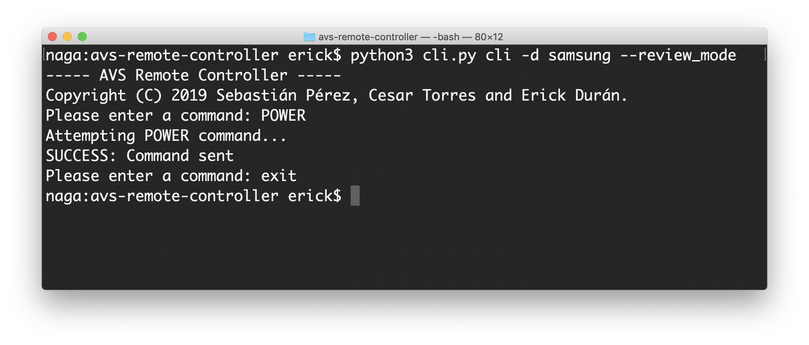

# avs-remote-controller
A voice-controlled universal remote using Amazon AVS and Raspberry Pi.

## Table of Contents
- [About the project](#about-the-project)
    - [Modes](#modes)
- [Getting started](#getting-started)
    - [Prerequisites](#prerequisites)
    - [Installation](#installation)
- [Usage](#usage)
- [Running the tests](#running-the-tests)
    - [`IRSender` tests](#irsender-tests)
    - [`CommandValidator` tests](#commandvalidator-tests)
- [Build](#build)
- [Version](#version)
- [Authors](#authors)
- [License](#license)
- [Acknowledgements](#acknowledgements)

## About the project

As mentioned, the general idea behind this project consists in an interface between an infrared remote controller (the circuit) and any desired client. This client may be a user using the CLI, a third party entity by using the API, or an Alexa Skill. These features are implemented using the different "modes" of operation of the current tool.

In the below section, you may find a brief description of each of the available modes. 

### Modes

#### `cli`
This mode is created as an interactive interface to use your `lirc` commands directly from your bash console. The device should be configured properly in `lirc` in order for it to work. You may use raw commands (as defined in `lirc`) by starting your command with `raw`, or composite commands, which let you interact in a more user-friendly way (e.g. `POWER`, `CHANNEL 15`, etc.).

#### `api`
A REST API to interact with the CLI wirelessly. Review mode may be used to interact with the CLI without sending actual commands.

#### `training`
This mode creates the `lirc` configuration for a new device. You may use this option or do it by yourself. Please remember to move your configuration file to the corresponding `lirc` directory.

#### `alexa`
An API to interact with _Alexa Voice Service_. This API uses the `flask-ask` library to parse AVS requests and send the corresponding commands using `lirc`. You may find the skill interaction model under `resources/alexa`.

## Getting started
### Prerequisites
This project was implemented using __Python 3__ (3.5.3) and it is designed for it. You will need to have this installed prior to usage, all tools needed are listed here: 

- [Python __3.5.3__](https://www.python.org/downloads/release/python-353/) with [pip](https://pip.pypa.io/en/stable/installing/)
- [lircd](http://lirc.org/html/lircd.html)

### Installation

To install all the project dependencies, use the following command:

```bash
pip3 install -r requirements.txt
```

To install `lircd` for Linux:
```bash
sudo apt-get install lirc
```

If you need more information about the necessary installation/setup process for `lircd`, please refer to our [CHANGELOG](CHANGELOG.md).


## Usage
To use our __ARC__, use the following command:

```bash
python3 cli.py MODE [OPTIONS]
``` 

- `MODE` is used to specify the mode of operation, current modes are `cli`, `api`, `alexa` and `training`.

Some available options are:
- `-d` or `--device`: the name of the device, configured with `lirc`, necessary for `cli`, `api`, `alexa` and `training` modes.
- `-r` or `--review_mode`: option that doesn't execute the commands, just for testing if everything is working properly and simulations.

__NOTE:__ Please note that it is necessary to have the `lirc` configuration for your device prior to using any of the modes. To create this configuration, you can use the `training` mode and copy the generated `conf` file to `/etc/lirc/lircd.conf.d/`.

You may see an execution example below for the CLI:




## Running the tests
For this project, we used the `unittest` framework to create our unit tests. In order to run them, run the following command:

```bash
python3 -m unittest discover -s tests -t tests -p *_test.py
```

Some example of unit tests are:

### `IRSender` tests

These tests were created to assert that all shell commands were generated correctly by the `IRSender`. These commands should be tested because they involve a shell execution sensitive to the syntax. 

Here is an example of one of the tests for the `KEY_POWER` raw command:
```python
def test_send_raw_power_command(self):
    command = 'KEY_POWER'
    expected = ['irsend SEND_ONCE {} {}'.format(self.__device, command)]
    result = self.__ir_sender.send_raw(command)
    self.assertEqual(expected, result)
```

### `CommandValidator` tests

These tests were created in order to assert the validation of existing commands. Since users are prompted a command that will be executed through the shell, it is important to validate that the command is registered, existent and properly written. This is for both functionality and security purposes.

Here is an example of one of the tests for the `POWER` command:

```python
def test_validate_valid_power_command(self):
    command = 'POWER'
    result = self.__command_validator.validate(command, None)
    self.assertTrue(result)
```

## Build
This project was built using:
- [Python 3.5.3](https://www.python.org/downloads/release/python-353/) under [Pipenv](https://docs.pipenv.org/en/latest/).

## Version
This repository stores v1.0 of the our AVS Remote Controller.

## Authors
Copyright © 2019, Sebastián Pérez, Cesar Torres and Erick Durán. CETYS Universidad.

## License
Released under the MIT License.

## Acknowledgements
- Based on the ideas of Tyler Nappy under [this post](https://hackernoon.com/make-your-tv-voice-controlled-through-amazon-alexa-and-raspberry-pi-a6373b7cf871).
- Developed along with the [Alexa SDK](https://github.com/alexa/avs-device-sdk) for the Synaptics AudioSmart kit.